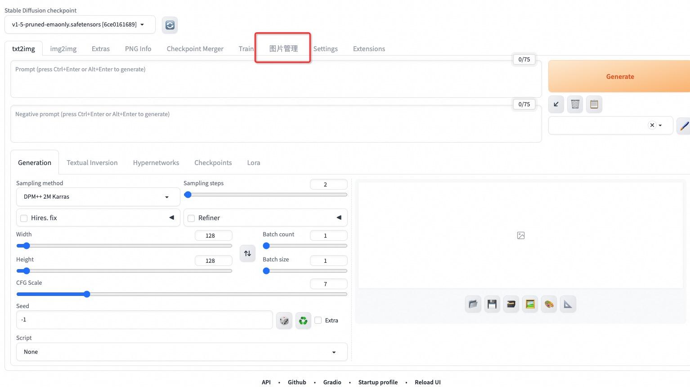
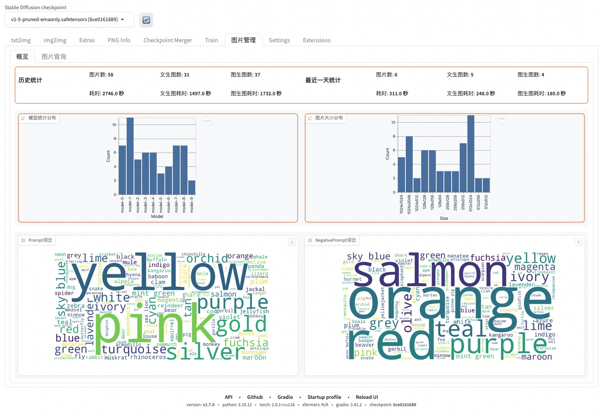

> README available in: [English](README.md) | [中文](README-zh.md)

# 简介

**Tablestore-sd-manager** 是 [AUTOMATIC1111's Stable Diffusion Web UI](https://github.com/AUTOMATIC1111/stable-diffusion-webui) 的一个可视化插件。

该插件可以存储提示词、参数、图片等信息到 [Tablestore](https://www.aliyun.com/product/ots/) 这个数据库中，然后你可以使用这个插件进行图片管理。

你可以使用云上托管的 serverless 的 `sd-web-ui` 更快捷地去搭建 `sd-web-ui` 服务和生成图片，[相关源码点击这里。](https://github.com/devsapp/fc-stable-diffuson)


# 使用

## 1. 下载安装插件
1. 打开 `Extensions` 子页面。
2. 打开 `Install from URL` 子页面。
3. 在 `URL for extension's git repository` 输入 `https://github.com/aliyun/aliyun-tablestore-tool-sd-manager-extension.git` 。
4. 点击 `Install` 按钮。
5. 等待 5 秒, 你将会看到提示语 `Installed into stable-diffusion-webui/extensions/aliyun-tablestore-tool-sd-manager-extension. Use Installed tab to restart.`,
   如果遇到了网络问题，你可以点击 `Install` 按钮重试几次。

## 2. 设置系统环境变量

在你启动 sd-web-ui 之前，请先设置如下操作系统环境变量。

| Variable                    | Example                                                  |
|-----------------------------|----------------------------------------------------------|
| `OTS_ENDPOINT_ENV`          | `https://demo-instance-name.cn-qingdao.ots.aliyuncs.com` |
| `OTS_ACCESS_KEY_ID_ENV`     | `access_key_id_xxxxx`                                    |
| `OTS_ACCESS_KEY_SECRET_ENV` | `access_key_secret_xxxxx`                                |
| `OTS_INSTANCE_NAME_ENV`     | `demo-instance-name`                                     |

##### 使用示范

下面仅列举 linux 的环境变量修改。
添加如下代码到自己的终端配置文件中，比如 `~/.bashrc` 中，注意需要执行 `source ~/.bashrc` 命令让本终端（Terminal）生效。
如果你使用的是高版本的苹果 macos 操作系统，注意终端配置文件可能是 `~/.zshrc`。

```bash
export OTS_ENDPOINT_ENV=https://demo-instance-name.cn-qingdao.ots.aliyuncs.com
export OTS_ACCESS_KEY_ID_ENV=access_key_id_xxxxx
export OTS_ACCESS_KEY_SECRET_ENV=access_key_secret_xxxxx
export OTS_INSTANCE_NAME_ENV=demo-instance-name
```

## 2. 在你的终端（Terminal）中完全重启  sd-web-ui 
> 如果你不知道终端（Terminal）的概念，完全重启你的电脑也能达到同样的效果。

设置好操作系统环境变量后，你可以重新启动你的 sd-web-ui 应用了。

## 3. 在 sd-web-ui 中使用插件

1. 点击进如本插件子页面.
    - 
2. 查看概览页面。
    - 
3. 管理历史图片。
    1. 查询之前。
        - 
    2. 查询后，你可以通过画廊组件进行快速图片浏览。
        - 
    3. 点击放大一张图片后，你可以看到该图片的详细信息。
        - 通过按键盘上的 'Esc' 按键或者点击图片右上角的 "x"来退出放大模式.
        - 