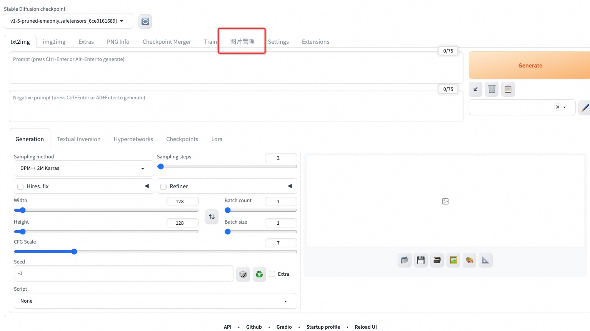
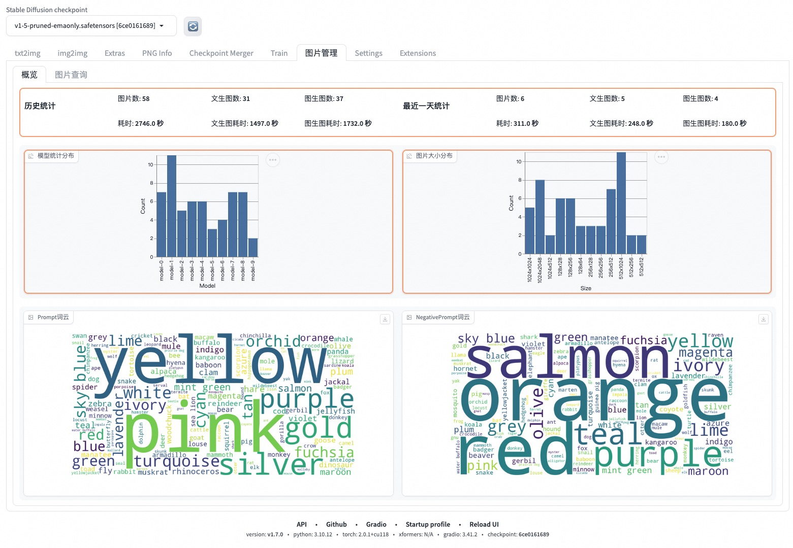
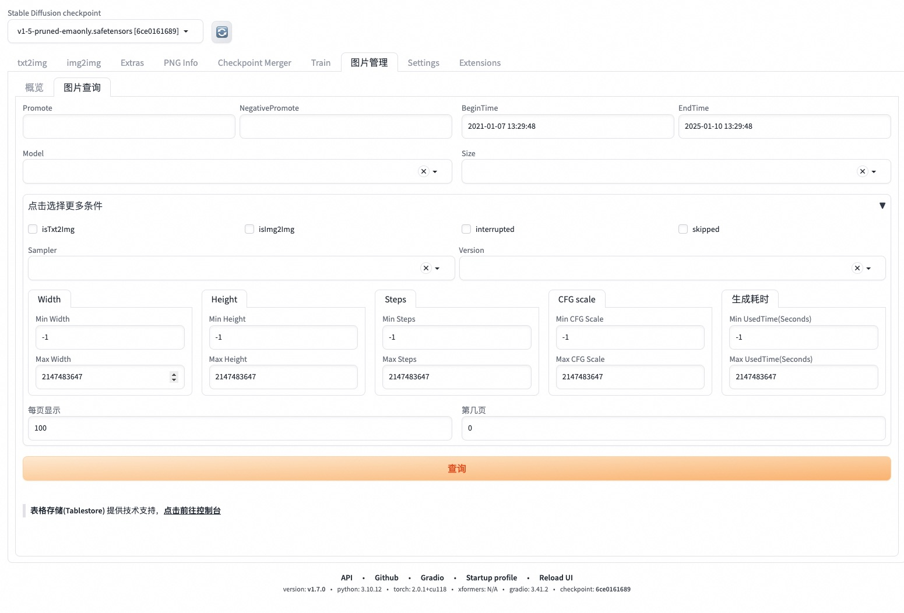
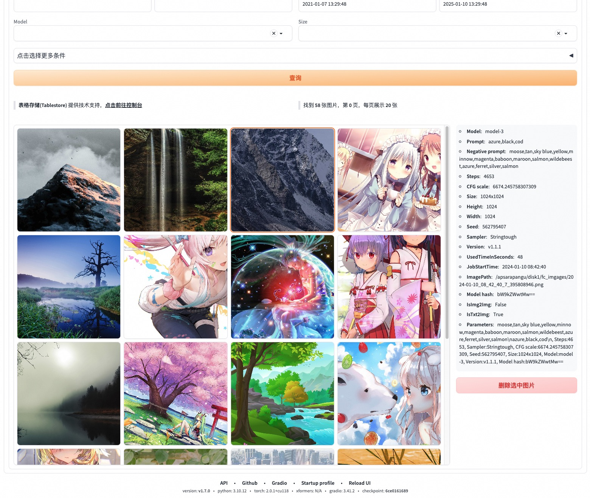
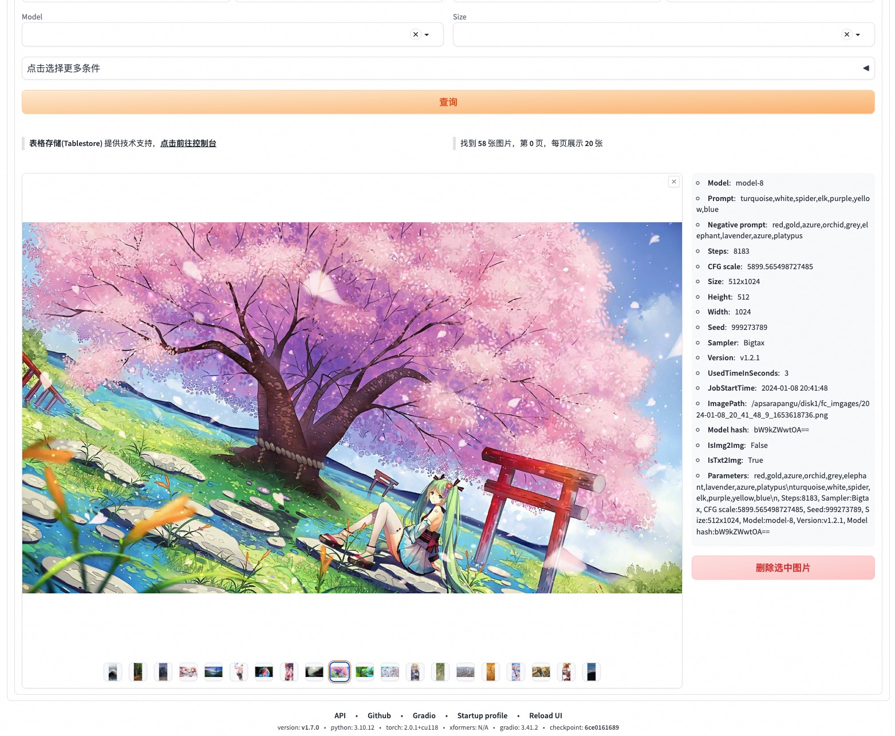

> README available in: [English](README.md) | [中文](README-zh.md)

# Introduction

**Tablestore-sd-manager** is an extension for [AUTOMATIC1111's Stable Diffusion Web UI](https://github.com/AUTOMATIC1111/stable-diffusion-webui).**

It allows to store prompt, parameters to tablestore, then you can search it by [Tablestore](https://www.aliyun.com/product/ots/).

You can use the serverless `sd-web-ui` hosted on the cloud to build `sd-web-ui` service and generate images more conveniently. [Source code link.](https://github.com/devsapp/fc-stable-diffuson)

# Usage

## 1. Install Extensions
1. Open `Extensions` tab.
2. Open `Install from URL` tab in the tab.
3. Enter `https://github.com/aliyun/aliyun-tablestore-tool-sd-manager-extension.git` to `URL for extension's git repository`.
4. Press `Install` button.
5. Wait for 5 seconds, and you will see the message `Installed into stable-diffusion-webui/extensions/aliyun-tablestore-tool-sd-manager-extension. Use Installed tab to restart.`.
   If you encounter network problems, you can press `Install` button and try again several times.

## 2. Set system environment variables

Set system environment variables before starting the app:

| Variable                    | Example                                                  |
|-----------------------------|----------------------------------------------------------|
| `OTS_ENDPOINT_ENV`          | `https://demo-instance-name.cn-qingdao.ots.aliyuncs.com` |
| `OTS_ACCESS_KEY_ID_ENV`     | `access_key_id_xxxxx`                                    |
| `OTS_ACCESS_KEY_SECRET_ENV` | `access_key_secret_xxxxx`                                |
| `OTS_INSTANCE_NAME_ENV`     | `demo-instance-name`                                     |

##### Example

The following only lists the Linux environment variable modifications.
Add the following code to your own terminal configuration file, such as `~/.bashrc`. Note that you need to execute the `source ~/.bashrc` command to make this terminal (Terminal) take effect. 
If you are using a later version of Apple's mac operating system, it may be the `~/.zshrc` file.

```bash
export OTS_ENDPOINT_ENV=https://demo-instance-name.cn-qingdao.ots.aliyuncs.com
export OTS_ACCESS_KEY_ID_ENV=access_key_id_xxxxx
export OTS_ACCESS_KEY_SECRET_ENV=access_key_secret_xxxxx
export OTS_INSTANCE_NAME_ENV=demo-instance-name
```

## 2. Completely restart webui including your terminal

> If you do not know what is a "terminal", you can reboot your computer to achieve the same effect.

After setting the system environment variables, you need to restart web-ui.

## 3. Use it in sd-web-ui

1. Click on the relevant tab.
    - 
2. View overview.
    - 
3. Manage and query historically generated images.
    1. Before query.
        - 
    2. After query, you can browse pictures through the gallery component.
        - 
    3. Click on a picture in the gallery to enlarge it, and you can view the detailed information of the picture.
        - Press the 'Esc' button on your keyboard or click the "x" in the upper right corner of the image to return to list mode.
        - 